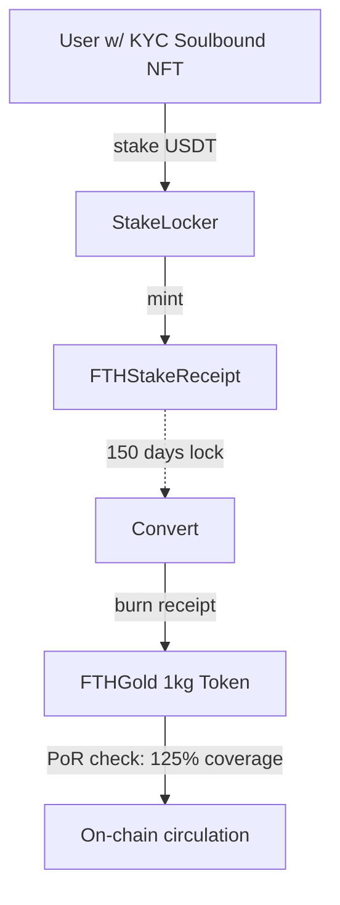

# FTH Infrastructure - Gold RWA Tokenization System

A minimal-yet-complete Real World Asset (RWA) system for tokenizing physical gold, built with Foundry and designed for institutional compliance.

## 🏗️ System Architecture



This repo houses the **FTH-G** private placement gold token stack:

- smart-contracts/fth-gold (Foundry) — KYC SBT, StakeLocker (5‑month lock), FTH‑G (1 kg), PoR interface, mocks, tests, deploy scripts
- docs — CEO brief, security & compliance checklists, QA matrix, and runbook
- .github/workflows — CI scaffold (Foundry tests + lint placeholders)

> Quick start below gets you to `forge test` on Sepolia or local Anvil in minutes.

### Key Components

1. **🔐 Identity Layer**: KYC Soulbound NFT for compliance
2. **💰 Staking Layer**: Time-locked USDT staking with receipt tokens
3. **🥇 Asset Layer**: 1kg gold-backed ERC20 tokens
4. **📡 Oracle Layer**: Chainlink Proof-of-Reserve integration
5. **⚡ Governance**: Role-based access control system

## 📁 Project Structure

```
fth-infrastructure/
├── smart-contracts/fth-gold/           # Core smart contracts
│   ├── contracts/
│   │   ├── access/AccessRoles.sol      # Role management
│   │   ├── compliance/KYCSoulbound.sol # Identity & compliance
│   │   ├── oracle/ChainlinkPoRAdapter.sol # Proof-of-Reserve
│   │   ├── staking/StakeLocker.sol     # Staking mechanism
│   │   └── tokens/
│   │       ├── FTHGold.sol            # Gold-backed ERC20
│   │       └── FTHStakeReceipt.sol    # Receipt tokens
│   ├── test/                          # Comprehensive test suite
│   ├── script/                        # Deployment scripts
│   └── foundry.toml                   # Foundry configuration
├── docs/                              # Documentation
└── .github/workflows/ci.yml           # CI/CD pipeline
```

## 🚀 Quick Start

### Prerequisites

- [Foundry](https://book.getfoundry.sh/getting-started/installation)
- Node.js 18+ (for additional tooling)

### Installation

```bash
git clone https://github.com/kevanbtc/fth-infrastructure
cd fth-infrastructure/smart-contracts/fth-gold

# Install dependencies
forge install

# Build contracts
forge build

# Run tests
forge test -vvv
```

### Environment Setup

```bash
cp .env.example .env
# Edit .env with your configuration
```

### Deployment

```bash
# Deploy to testnet
forge script script/Deploy.s.sol --broadcast --rpc-url $SEPOLIA_RPC_URL

# Configure post-deployment
forge script script/Configure.s.sol --broadcast --rpc-url $SEPOLIA_RPC_URL
```

## 🔄 System Flow

### 1. Identity Verification
Users receive a KYC Soulbound NFT after completing compliance verification:
- Non-transferable identity token
- Expiry-based validation
- Jurisdiction and accreditation tracking

### 2. Staking Process
```solidity
// User stakes USDT for 1kg gold allocation
stakeLocker.stake1Kg(20_000_000); // 20 USDT (6 decimals)
```

### 3. Time Lock
- 150-day mandatory lock period
- Receipt tokens are non-transferable (soulbound-like)
- Ensures long-term commitment

### 4. Conversion
```solidity
// After lock period + PoR verification
stakeLocker.convert(); // Burns receipt, mints FTHGold
```

### 5. Proof of Reserve
- Chainlink oracle integration
- 125% minimum coverage requirement
- Real-time reserve validation

## 🧪 Testing

### Test Coverage

- **KYCSoulbound.t.sol**: Identity and compliance tests
- **FTHStakeReceipt.t.sol**: Receipt token functionality
- **Stake.t.sol**: Staking and conversion flow
- **OracleGuards.t.sol**: Oracle failure scenarios

```bash
# Run all tests
forge test

# Run with gas reporting
forge test --gas-report

# Run coverage analysis
forge coverage
```

## 🔐 Security Features

### Smart Contract Security
- OpenZeppelin battle-tested contracts
- Reentrancy protection
- Pausable emergency controls
- Role-based access control

### Compliance Features
- KYC/AML through soulbound NFTs
- Jurisdiction tracking
- Accredited investor verification
- Time-locked commitments

### Oracle Security
- Chainlink Proof-of-Reserve
- Staleness protection
- Coverage ratio enforcement
- Fallback mechanisms

## 📊 Gas Optimization

The system is optimized for gas efficiency:
- Minimal storage operations
- Batch processing capabilities
- Efficient role management
- Optimized token transfers

## 🏛️ Governance

### Roles and Permissions

- **DEFAULT_ADMIN_ROLE**: Overall system administration
- **GUARDIAN_ROLE**: Emergency controls (pause/unpause)
- **ISSUER_ROLE**: Token minting/burning
- **KYC_ISSUER_ROLE**: Identity verification
- **ORACLE_ROLE**: Price feed management

### Upgradability

The system uses a non-upgradeable approach for security and immutability, with careful role management for necessary administrative functions.

## 🌍 Why FTH Gold Matters

### 🔐 Compliance-Native
- FATF guidelines compliance
- SEC Regulation D alignment
- Basel III compatibility

### 🏛️ Institutional Ready
- Chainlink Proof-of-Reserve
- Time-locked staking mechanism
- Professional grade security

### 💰 RWA Yield Unlock
- Stable staking receipts
- Gold-backed value stability
- DeFi integration ready

### 🌐 Future Proof
- Modular architecture
- Cross-chain compatible
- Extensible to other RWAs

## 📈 Monetization Model

- **Staking Fees**: Revenue from USDT staking
- **Vaulting Spreads**: Margin on physical gold storage
- **Compliance SaaS**: KYC/compliance services
- **Oracle Licensing**: PoR technology licensing

## 🛣️ Roadmap

- [ ] **Phase 1**: Core system deployment (Current)
- [ ] **Phase 2**: Multi-chain expansion
- [ ] **Phase 3**: Additional RWA integration (water, carbon, real estate)
- [ ] **Phase 4**: Institutional partnerships
- [ ] **Phase 5**: Regulatory approval expansion

## 📚 Documentation

- [Security Checklist](docs/Security-Checklist.md)
- [Compliance Guide](docs/Compliance-Checklist.md)
- [QA Test Matrix](docs/QA-Test-Matrix.md)
- [Operational Runbook](docs/Runbook.md)
- [CEO Brief](docs/CEO-brief.md)

## 🤝 Contributing

1. Fork the repository
2. Create a feature branch
3. Make your changes
4. Add comprehensive tests
5. Submit a pull request

## 📄 License

This project is licensed under the MIT License - see the [LICENSE](LICENSE) file for details.

## ⚠️ Disclaimer

This system is for demonstration purposes. Before production deployment:
- Complete professional security audit
- Obtain necessary regulatory approvals
- Implement production-grade oracle systems
- Establish proper legal structures

---

**Built with ❤️ by Future Tech Holdings**

*This is not a "token experiment" — it's the foundation stone for Future Tech Holdings' real-world asset empire.* 🏗️🌍💎
